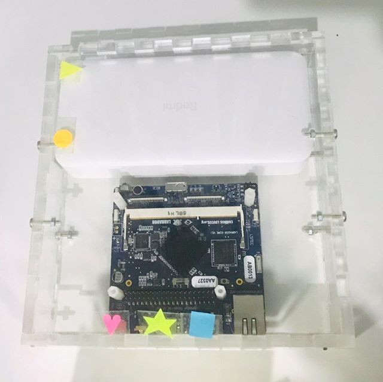
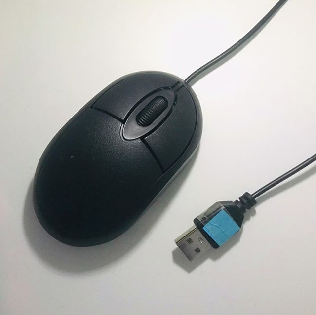
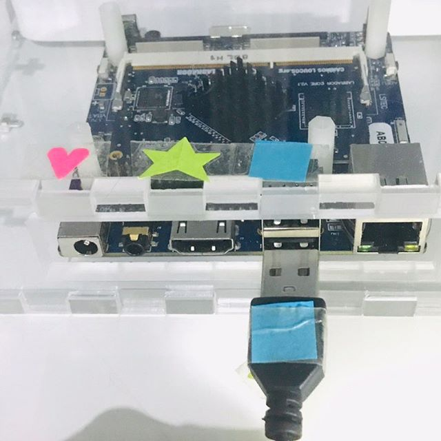
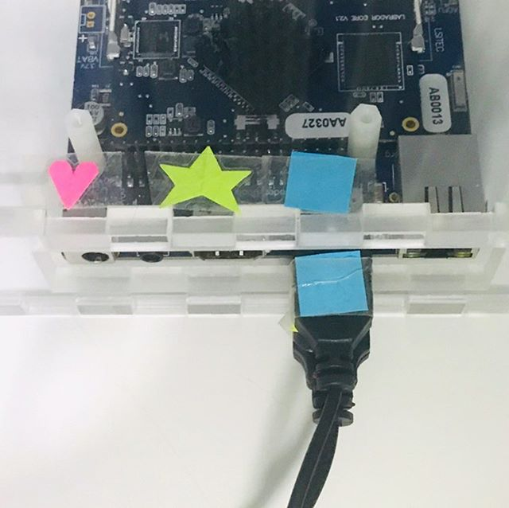
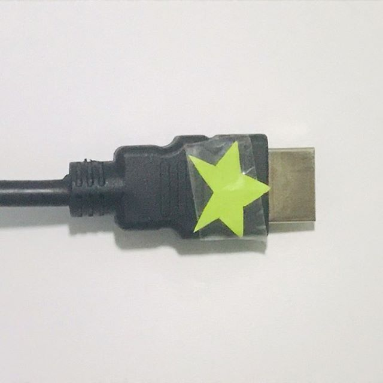
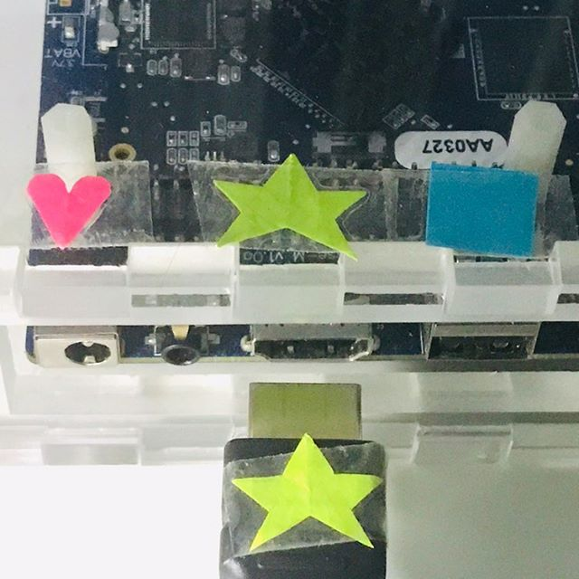
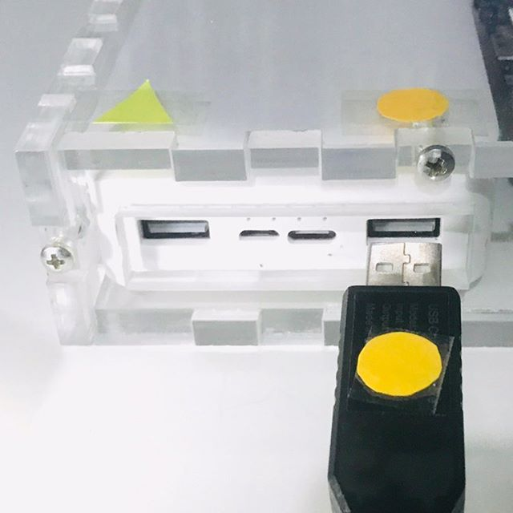
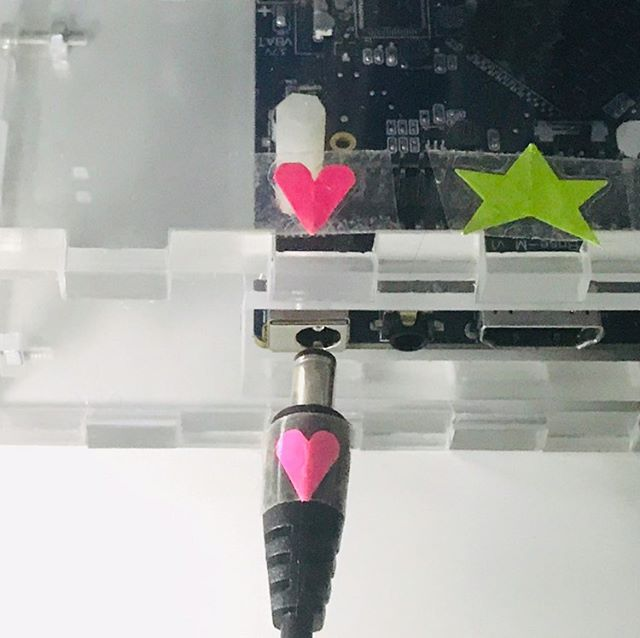

## Manual de utilização do Kit-Aluno

Olá! Com este material você vai aprender a montar o seu computador para que ele possa te ajudar durante as aulas. Então pegue uma das caixinhas com os dispositivos e vamos nessa!

O kit que você acaba de receber é um computador igual aos que você já deve conhecer, com a diferença de que ele é menor e portátil. As peças que você pode ver nele existem em qualquer computador comum, mas em outros computadores elas estão sempre conectadas e com uma carcaça protetora que impede você de ver o interior do computador, mas nesse kit você pode ver cada parte, conectar e entender o que cada uma faz. 

### Apresentando os dispositivos

A seguir você vai conhecer cada um dos componentes que fazem parte do kit que você recebeu.

- CPU

Esta é a CPU do nosso kit. É nela que toda a mágica acontece e com ela é possível fazer contas, navegar na internet, jogar um jogo e fazer muitas outras coisas. Nela é possível ver um carregador portátil e uma placa de desenvolvimento, e para tudo funcionar e você poder usar o computador, será necessário conectar alguns fios na CPU.

- Placa de Desenvolvimento

A placa de desenvolvimento é o coração do computador. Ela possui todos os materiais que você irá acessar e é com ela que você poderá fazer diversas tarefas. Ela recebe palavras e números do teclado e do mouse e envia imagens para o monitor. Para funcionar, ela precisa receber energia, por isso sempre que você for utilizá-la será necesário conectá-la na tomada ou em um carregador portátil.

- Carregador portátil

O carregador portátil serve para fornecer energia para as diferentes partes do nosso computador. Sem ele tudo precisaria ser alimentado de outra forma, como por meio de tomadas, por exemplo. No nosso computador, ele irá fornecer energia para a placa de desenvolvimento e para o monitor, os demais componentes receberão energia diretamente da placa de desenvolvimento, ela é um canal que leva energia do carregador portátil para o teclado e o mouse.

- Monitor

O monitor é que mostra para você o que está acontecendo no computador. Com ele nós podemos ver o que estamos fazendo e como o computador está respondendo às tarefas.

- Mouse

Com o mouse é possível selecionar e arrastar os objetos que estão sendo mostrados pelo monitor. Ele pode ser usado por pessoas destras (mão direita dominante) ou canhotas (mão esquerda dominante) e possui sempre três teclas principais: A tecla esquerda, que serve para selecionar e arrastar os objetos; a tecla direita que serve para ver as opções de tarefas que podem ser realizadas em um objeto (como copiar e colar) e uma rodinha que serve para subir ou descer o conteúdo de uma janela.

- Teclado

Com o teclado é possível escrever palavras ou números, navegar por opções em uma lista e acessar alguns comandos específicos do computador. Nele há diversas teclas e muitas delas realizam atividades que vão além de apenas escrever. 

### Montando o computador

Para que você possa utilizar o computador, será necessário primeiro conectar todos as partes. Cada parte possui entradas e saídas e elas tem lugares corretos para serem conectados e funcionarem bem. 

1. Para começar, tenha certeza que a CPU está posicionada para cima, como mostra a imagem a seguir:

2. Em seguida, pegue o fio que vem com o teclado e insira o conector com quadrado azul que está na ponta deste fio em uma das duas entradas com quadrado azul da placa de desenvolvimento, indicada na imagem a seguir. Para tudo encaixar direitinho, o quadrado azul do conector precisa estar virado para cima.

3. Agora pegue o fio que vem com o mouse e insira o conector com quadrado azul que está na ponta deste fio na outra entrada com quadrado azul da placa de desenvolvimento. O o quadrado azul do conector também precisa estar virado para cima para poder ser encaixado na entrada, como mostra a imagem a seguir:

4. Para que as imagens sejam exibidas no monitor, é necessário conectá-lo na placa de desenvolvimento. Para isso, pegue os dois fios que saem do monitor e verifique qual tem uma estrela verde, como mostra a imagem a seguir:

Ao encontrar este conector, insira-o com a estrela verde para cima, na entrada que também tem uma estrela verde, como na imagem a seguir:

5. Agora pegue o outro cabo do monitor e insira o conector do cabo com um triângulo amarelo na entrada com triângulo amarelo do carregador portátil. Antes de inserir confira se o triâgulo amarelo do conector está virado para cima, como mostra a imagem a seguir:

6. Quando todos os dispositivos estiverem conectados, como foi mostrado nos passos anteriores, é o momento de conectar a placa de desenvolvimento na energia e ligá-la. Para isso, pegue o cabo que possui um conector redondo, com um coração rosa em uma das pontas e um conector com bolinha laranja na outra. Insira o conector com coração rosa na entrada que também possui um coração rosa da placa de desenvolvimento, como mostra a imagem a seguir:

Agora insira o conector com bolinha laranja da outra ponta do fio na entrada com bolinha laranja do carregador portátil. Antes de inserir, tenha certeza que a bolinha laranja do conector está virada para cima, como mostra a imagem a seguir:

Pronto, agora todos os componentes estão conectados e a placa de desenvolvimento está iniciando automaticamente. Se tudo estiver conectado certinho, em alguns instantes uma imagem aparecerá no monitor e então você poderá digitar com o teclado e utilizar o mouse.
