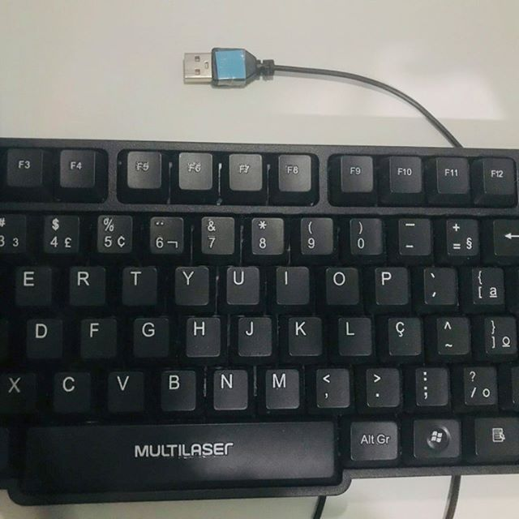

## Manual de utilização do Kit-Aluno

Olá! Com este material você irá aprender a montar o seu computador para que ele possa te auxiliar durante as aulas. Então pegue uma das maletas com os dispositivos e vamos nessa!

O kit que você acaba de receber nada mais é do que um computador igual aos que você já deve conhecer, com a diferença de que ele é menor e portátil. As peças que você pode ver nele existem em qualquer computador comum, mas em outros computadores elas estão sempre conectadas e com uma carcaça protetora que impede que você possa vê-las, mas nesse kit você pode visualizá-las, conectar cada parte e entender o que cada uma faz. 

### Apresentando os dispositivos

A seguir você conhecerá cada um dos componentes que fazem parte do kit que você recebeu.

- CPU

Esta é a CPU do nosso kit. É nela que toda a mágica acontece e com ela é possível fazer contas, navegar na internet, jogar um jogo e fazer muitas outras coisas. Nela é possível ver um carregador portátil e uma placa de desenvolvimento, e para tudo funcionar e você poder usar o computador, será necessário conectar alguns dispositivos na CPU.

- Placa de Desenvolvimento

A placa de desenvolvimento é o coração do computador. Ela possui todos os conteúdos que você irá acessar e é com ela que você poderá fazer diversas tarefas. Ela recebe sinais do teclado e do mouse e envia sinais de imagem para o monitor. Para funcionar, ela precisa receber energia, por isso sempre que você for utilizá-la será necesário conectá-la na tomada ou em um carregador portátil.  

- Carregador portátil

O carregador portátil serve para fornecer energia para os componentes do nosso computador. Sem ele tudo precisaria ser alimentado de outra forma, como por meio de tomadas, por exemplo. No nosso computador, ele irá fornecer energia para a placa de desenvolvimento e para o monitor, os demais componentes receberão energia diretamente da placa de desenvolvimento, ela é um canal que leva energia do carregador portátil para o teclado e o mouse.

- Monitor

O monitor é o dispositivo que mostra para você o que está acontecendo no computador. Com ele nós podemos ver o que estamos fazendo e como o computador está respondendo às tarefas.

- Mouse

Com o mouse é possível selecionar e arrastar os objetos que estão sendo mostrados pelo monitor. Ele pode ser usado por pessoas destras (mão direita dominante) ou canhotas (mão esquerda dominante) e possui sempre três teclas principais: A tecla esquerda, que serve para selecionar e arrastar os objetos; a tecla direita que serve para ver as opções de tarefas que podem ser realizadas em um objeto (como copiar e colar) e uma rodinha que serve para subir ou descer o conteúdo de uma janela.

- Teclado

Com o teclado é possível escrever palavras ou números, navegar por opçẽos em uma lista e acessar alguns comandos específicos do computador. Nele há diversas teclas e muitas delas realizam atividades que vão além de apenas escrever. 

### Montando o computador

Para que você possa utilizar o computador, será necessário primeiro conectar todos os componentes. Eles possuem entradas e saídas e elas tem lugares corretos para serem conectados e funcionarem bem. 

1. Para começar, certifique-se de que a CPU está posicionada para cima, como mostra a imagem a seguir:

2. Em seguida, pegue o fio que vem com o teclado e insira o conector que está na ponta deste fio em uma das duas entradas retangulares da placa de desenvolvimento, indicada na imagem a seguir. Certifique-se que o desenho do conector está virado para cima quando for tentar conectar, desta forma será possível inserir o conector com facilidade.

3. Agora pegue o fio que vem com o mouse e insira o conector que está na ponta deste fio na outra entrada retangular da placa de desenvolvimento. O desenho deste conector também precisa estar virado para cima para poder ser encaixado na entrada, como mostra a imagem a seguir:

4. Para que as imagens sejam exibidas no monitor, é necessário conectá-lo na placa de desenvolvimento. Para isso, pegue os dois fios que saem do monitor e verifique qual deles se parece com a imagem a seguir:

Ao identificar este conector, posicione-o para que a parte mais larga fique para cima, como na imagem a seguir, e insira-o na entrada que está indicada na imagem a seguir:

5. Agora pegue o outro cabo do monitor e insira o conector do cabo em uma das entradas retangulares do carregador portátil. Desta vez, certifique-se que o desenho do conector esteja virado para baixo ao conectar, como mostra a imagem a seguir:

6. Quando todos os dispositivos estiverem conectados, como foi mostrado nos passos anteriores, é o momento de conectar a placa de desenvolvimento na energia e ligá-la. Para isso, pegue o cabo que possui um conector redondo em uma das pontas e um conector retangular na outra. Insira o conector redondo do cabo na entrada em forma de círculo da placa de desenvolvimento, como mostra a imagem a seguir:

Agora insira o conector da outra ponta do fio na entrada retangular do carregador portátil. Antes de inserir, certifique-se que o conector está com o desenho virado para baixo, como mostra a imagem a seguir:

Pronto, agora todos os componentes estão conectados e a placa de desenvolvimento está inicializando automaticamente. Se tudo estiver conectado corretamente, em alguns instantes uma imagem aparecerá no monitor e será possível digitar com o teclado e utilizar o mouse.
