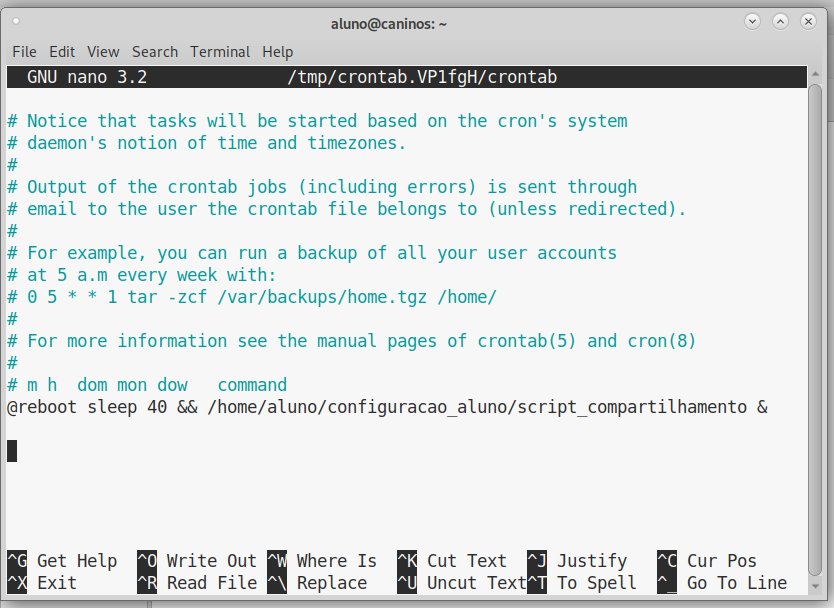
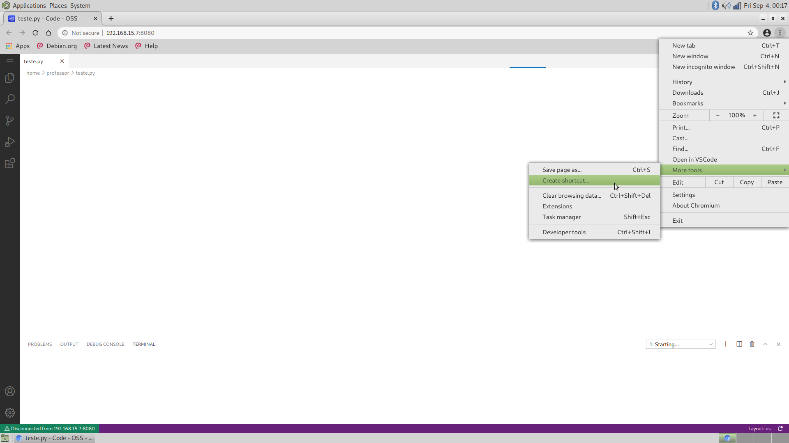
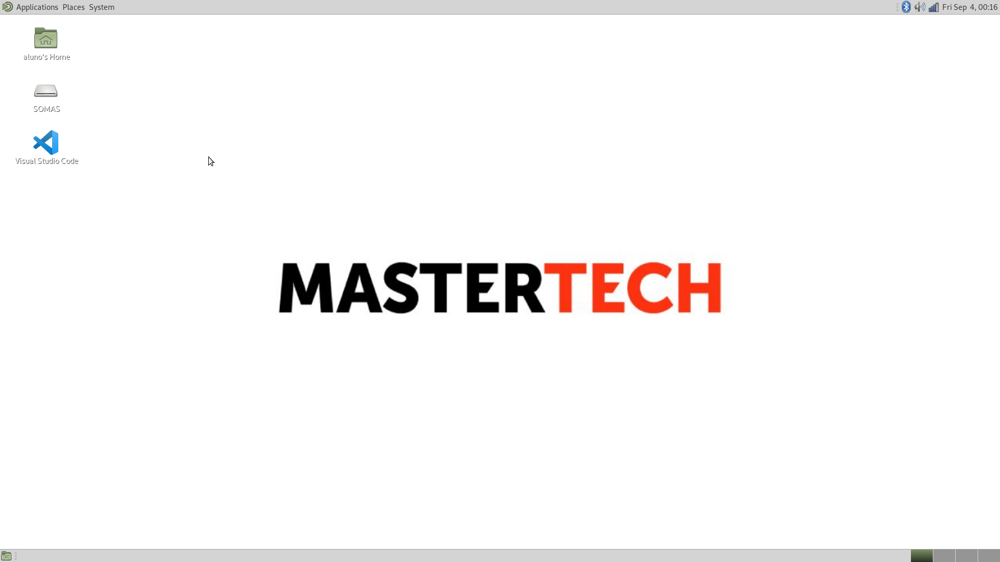

## Tutorial para configuração do Labrador do kit aluno.

Este tutorial foi feito para o sistema operacional Ubuntu Mate. É importante que a máquina esteja logada numa conta chamada "aluno" e que o SO esteja em inglês (Caso a máquina tenha outro nome, será necessário trocar todas as ocorrências da palavra "aluno" no script de instalação do Labrador do aluno e nas configurações dos atalhos criados para o W3Schools e o VSCode).
Para que tudo seja configurado corretamente, é importante que a máquina do professor seja configurada primeiro e o Labrador seja configurado depois. É importante também que ambas as máquinas estejam conectadas na mesma rede Wi-fi.

### Criando o usuário aluno
Caso o usuário aluno ainda não exista, basta executar os comandos a seguir no terminal e incluir a senha sempre que necessário. Não é necessário adicionar nenhuma outra informação à conta do aluno além da senha.

```console
sudo adduser aluno
sudo su
usermod -aG sudo aluno
su - aluno
sudo whoami
```

Após a execução do último comando, a saída do terminal indicará se a conta aluno recém criada possui ou não permissões root, e é esperado que ela tenha. Após isso, encerre a sessão no usuário "caninos" a faça o login na conta "aluno".

### Ativando SSH

Primeiramente é necessário ativar a conexão SSH do Labrador. Para isso, execute os comandos a seguir no terminal.

```console
sudo apt-get install openssh-server
sudo service ssh start
sudo service ssh status
```

É esperado que na saída do terminal esteja indicado que o status do SSH está ativado.

### Criando a key-pair e enviando para o professor
Para que a montagem da pasta compartilhada possa acontecer sem que o usuário precise inserir a senha da máquina do professor sempre que o Labrador for se conectar, é possível enviar a chave pública da conta do aluno para a máquina do professor via SSH.

Caso a conta do aluno ainda não tenha um key-pair, é possível gerá-lo executando o comando a seguir no terminal.

```console
ssh-keygen -t rsa
```

Ao executar este comando, aperte enter para todas as opções que aparecer, para que a chave tenha as configurações padrão e não solicite senha durante as conexões com a máquina do professor.

Para enviar a chave pública para o notebook do professor é necessário executar o comando a seguir, alterando "IP_Profesor" para o IP da máquina do professor.

```console
ssh-copy-id -i ~/.ssh/id_rsa.pub professor@IP_Professor
```

Quando for solicitado, confirme a transferência digitando "yes" e apertando a tecla Enter.
Insira a senha do notebook do professor caso ela seja solicitada.

### Utilizando o script de instalação

Para que os programas sejam instalados e o sistema operacional seja configurado, foi criado um script de instalação. Clone este repositório no Labrador do kit aluno e, antes de utilizar o script _"script_aluno"_, edite-o com o editor de texto de sua preferência: Troque o valor da variável "IP_Professor" que está na 5ª linha do arquivo para o IP da máquina do professor.

Edite também o arquivo _"script_compartilhamento.sh"_, alterando o valor da variável "IP_Professor" que está na 4ª linha do arquivo para o IP da máquina do professor.

É necessário também alterar a permissão deste script, para que ele possa ser executado. Para isso, navegue com o terminal até a pasta onde o script se encontra e execute o comando a seguir.

```console
chmod u+x script_aluno
```
Antes de executá-lo, certifique-se que o usuário "aluno" tem permissões root, rodando os comandos a seguir:

```console
sudo su - root
sudo usermod -aG sudo aluno
exit
```


Pronto, para executá-lo, rode o comando a seguir no mesmo terminal.

```console
./script_aluno
```

Caso seja solicitado, insira a senha do root do Labrador.

Aguarde o término do script, e quando isto acontecer todos os softwares já estarão instalados.

### Crontab

Para que a pasta "SOMAS", que foi criada pelo script, possa ser montada com a pasta "SOMAS" do notebook do professor, e assim permitir o compartilhamento de arquivos sem a necessidade de internet, é necessário que esta pasta seja montada via SSHFS na pasta remota sempre que o Labrador iniciar.

Essa montagem apenas poderá acontecer se o notebook do professor e o Labrador estiverem conectados na mesma rede Wi-fi. Assim, foi utilizado um script disponibilizado em um fórum da internet [(Referência)](https://askubuntu.com/questions/3299/how-to-run-cron-job-when-network-is-up), que se encontra no arquivo "script_compartilhamento.sh" deste repositório GIT, que realiza um ping na rede para saber se o Labrador já está conectada ao mesmo Wi-fi do notebook do professor. Caso ela não esteja, o ping é realizado outras vezes para verificar a conexão novamente. Essa checagem acontecerá no máximo 5 vezes. Caso o ping retorne indicando que o Labrador nunca se conectou, a montagem não acontecerá. Caso o ping retorne indicando que o Labrador está conectada ao Wi-fi, a montagem da pasta local com a pasta remota será realizada.

E para que este script seja executado sempre que o Labrador seja iniciado, foi adicionada uma linha ao Crontab da conta do aluno, indicando que esse script deve ser sempre executado 40 segundos depois que o Labrador iniciar (para dar tempo de logar na conta do aluno e a conexão Wi-fi ser estabelecida).

Para configurar o Crontab para fazer isso, é necessário rodar o comando a seguir para editar o arquivo

```console
crontab -e
```

e adicionar a linha a seguir no final do arquivo (verifique se o script realmente está na pasta indicada).

```console
@reboot sleep 40 && /home/aluno/configuracao_labrador/script_compartilhamento.sh &
```

O arquivo deve ficar como a imagem a seguir, porém com o caminho "/home/aluno/configuracao_labrador/script_compartilhamento.sh".




Pronto, sempre que o Labrador for inicializado e a conexão com Wi-fi for estabelecida, a pasta local será montada com a pasta remota. É importante assim, sempre conectar o notebook do professor ao Wi-fi antes de inicializar o Labrador.

Desta forma, tudo que for adicionado numa pasta "SOMAS" que foi montada na pasta "SOMAS" do notebook do professor estará disponível para o professor e para todas as outras pastas "SOMAS" que já foram montadas e estão em dispositivos conectados na mesma rede Wi-fi que o professor.

### Atalhos

A pasta compartilhada automaticamente terá um atalho na área de trabalho, quando ela for montada.

Para criar o atalho do W3Schools, copie o arquivo W3Schools.desktop deste repositório GIT para sua Área de Trabalho.

E para criar o atalho do VSCode, abra o navegador web Chromium e vá para o endereço "IP_Professor:8080" (substituindo IP_Professor pelo IP do notebook do professor), clique no botão com três pontos no navegador, clique em "Mais ferramentas" no menu drop-down que abrir e em seguida clique em "Criar atalho", como mostra a imagem a seguir.



Clique em "Criar" na janela de confirmação que aparecer, e um arquivo novo irá aparecer na sua área de trabalho. 
Edite este arquivo com o editor de texto da sua preferência, alterando-o para que as categorias "Name" e "Icon" fiquem iguais as do arquivo VSCode.desktop deste repositório GIT. As outras categorias devem permanecer inalteradas.

Teste cada um dos atalhos para verificar se eles funcionam como o esperado (O atalho do VSCode apenas funcionará caso o comando do code-server estiver sendo executado no terminal do notebook do professor).

A área de trabalho do notebook do professor deverá se parecer com a imagem a seguir.



### Alterando a linguagem

A configuração padrão de linguagem do Labrador é inglês americano, para alterá-la para o português brasileiro será necessário encerrar a sessão na conta "aluno", logar na conta "caninos" e rodar o seguinte comando no terminal:

```console
sudo dpkg-reconfigure locales
```

Ao pressionar enter aparecerá um menu com diversas opções de linguagem. Desça até a opção "pt\_BR.UTF-8 UTF-8", aperte barra de espaço para selecionar esta linguagem e dê enter. Na tela seguinte selecione novamente "pt\_BR.UTF-8 UTF-8" e dê enter novamente.

Em seguida, após a conclusão do comando anterior, execute os seguintes comandos:

```console
localectl set-locale LANG=pt_BR.UTF-8
sed -i "s/pt_BR/en_US/" ~/.dmrc
```

Em seguida reinicie o Labrador e a placa irá iniciar em portguês brasileiro.
